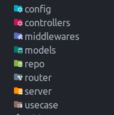

# Package Create Skeleton Project Go

### v1.0.1

# Installation

Just use go get.

```go
go get github.com/fikrigatrh/create-skeleton
```

And then just import the package into your own code.

```go
import (
	"github.com/fikrigatrh/create-skeleton"
)
```

# Usage

Call function with param ***create_ton***

```
gtr_skeleton.CreateTon("create_ton")
```

if successfull, you will see some base folder



### Happy Working with Go, Coders!!